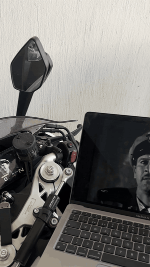

# Ridedaemon Lib

A Go implementation of the phone-mirroring protocol used by CFMoto's in-dash
infotainment/HUD units to receive a live video feed from a paired phone.
Ridedaemon lets you run your own daemon or app in place of CFMoto's
official app, using the same discovery, handshake, and streaming behavior the
head unit already expects.

This is the core library (`ridedaemon-lib`). A companion Android app built
on top of it, demonstrating a full integration, lives in a separate repo.

It's built as two things:

- **A standalone Go library/daemon** you can run on a laptop or any Go-capable
  device, feeding it a video source (e.g. desktop capture via `ffmpeg`).
- **A `gomobile`-friendly API** (`hud/api`) meant to be bound into an Android
  app, where you push encoded camera/screen frames in from Kotlin and this
  library handles discovery, the control channel, and the streaming channel.

## Demo

The `cmd/hud-desktop` demo streaming to a CFMoto head unit:



## How it fits together

The head unit (HU) advertises itself over mDNS and speaks a small set of
custom TCP protocols. This library implements the phone side of each:

| Package | Responsibility |
|---|---|
| `hud/net` | Wire protocols: mDNS discovery, the EC init handshake, the PXC control channel (RSA keypair exchange + HUD config negotiation + heartbeat), the media control channel, and the poll-driven media streaming channel. |
| `hud/core` | `CfmotoHUD` orchestrates discovery, handshake, and the three long-lived servers (PXC, media control, media stream) into one session lifecycle. |
| `hud/stream` | H.264 Annex-B access-unit (AU) framing: splitting/joining AUD-delimited AUs, a live ring-buffer frame source, a static "no signal" fallback, and muxing between the two. |
| `hud/api` | The `gomobile`-facing surface (`MobileSession`) is the entry point for an Android app: discover host, start/stop a session, and push AVCC-formatted frames in (auto-converted to Annex-B). |
| `cmd/hud-desktop` | A desktop demo that captures your screen with `ffmpeg`/`avfoundation` and streams it to the HU, useful for testing the protocol without a phone. |
| `internal/logging` | A build-tag gated logger. Verbose under `-tags debug`, silent otherwise. |

## Protocol overview

1. **Discovery**. The HU advertises a `_EasyConn._tcp` mDNS service. The
   client resolves it to an IP/port and expected package name.
2. **EC init**. A short TCP handshake announces the "phone" and its package
   name before anything else starts.
3. **PXC control channel** (`:10922`). An RSA keypair is generated per
   session; the HU sends its config, the client responds with a phone config
   (including an RSA-encrypted HUID), then the channel carries periodic
   heartbeats and small control events (speed config, client settings, etc).
4. **Media control channel** (`:10921`). A lightweight command/response
   channel for screen/view configuration and keepalive pings.
5. **Media stream channel** (`:10920`). The HU polls for frames
   (`REQ_RV_DATA_NEXT` / `0x72`); each poll is answered with the next
   available H.264 access unit, length-prefixed and chunked to keep latency
   low. No poll, no frame: the HU's poll loop is the frame clock.

## Video format notes

The HU behaves like an embedded H.264 decoder, not a general streaming
client:

- Bitstream is **Annex-B**, one AU per poll response, each AU expected to
  start with an AUD NAL.
- No B-frames, no long GOPs. The HU has little tolerance for reference loss,
  so an IDR-every-frame or IDR-every-2-frames structure is expected.
- Typical working config: ~800×400, 15-30 fps, baseline/main profile,
  2-3 Mbps.
- Frames pushed in from mobile are commonly AVCC (4-byte length-prefixed)
  coming out of `MediaCodec`; `hud/api.BuildAnnexBAU` detects and converts
  both AVCC and already-Annex-B input.

See `docs/` for the fuller research notes this implementation is based on.

## Using it

### As a desktop daemon (testing/demo)

```bash
go run ./cmd/hud-desktop
```

Requires `ffmpeg` on your `PATH` (uses `avfoundation` for screen capture, so
this demo is macOS-only as written; swap the input args in
`hud/stream/desktop_stream.go` for other platforms). It discovers the paired
head unit over mDNS, starts a session, and streams your screen to it, falling
back to a static/no-signal clip when there's no active source.

### As a library, from Go

```go
mux := &stream.MuxSource{NoSignal: staticSource, Live: liveSource}
hud := core.NewCfmotoHUD(30, mux)

if err := hud.SearchForHost(ctx, 10*time.Second); err != nil {
    log.Fatal(err)
}
if err := hud.StartStream(ctx); err != nil {
    log.Fatal(err)
}
// push frames into liveSource as they're encoded elsewhere
```

### From Android (via gomobile)

Bind `hud/api` with `gomobile bind`, then from Kotlin:

```kotlin
val session = Api.newMobileSession(config, callback)
session.discoverHost()
session.setECHost(host)
session.startSession()
// on each encoded frame from MediaCodec:
session.pushFrame(avccBytes)
```

`MobileCallback` reports errors, protocol events, and session-stopped back
to the app:

```go
type MobileCallback interface {
    OnError(msg string, fatal bool)
    OnEvent(time int64, source int, command int, payload []byte)
    OnStopped()
}
```

`source` identifies which channel the event came from (PXC, media control,
etc), and `command` identifies the specific protocol command that triggered
it, useful for telling apart, say, a view-config push from a heartbeat
without parsing `payload` yourself.

**Note for existing integrations:** `OnEvent` gained the `command` parameter
in a recent update, previously it was `OnEvent(time int64, source int,
payload []byte)`. If you implemented `MobileCallback` against an older
build, add the extra `int` parameter and rebuild against the current AAR.

## Building

```bash
go build ./...
```

To build the mobile bindings you'll need `gomobile` set up
(`go install golang.org/x/mobile/cmd/gomobile@latest && gomobile init`), then:

```bash
gomobile bind -target=android ./hud/api
```

`gomobile bind` also supports iOS (`-target=ios`), producing an XCFramework
instead of an AAR. Note: that leg needs to run on macOS with Xcode installed, but
no code changes are required on the Go side to support it.

## Status

This was built through independent protocol analysis of the head unit and
its companion app, for use with hardware I own. It's not affiliated with or
endorsed by CFMoto. Contributions and protocol corrections are welcome.

## License

GPL-3.0. See [LICENSE](LICENSE.md).

In short:

**You can:**
- Use, study, and modify this code, including commercially.
- Redistribute it, modified or not.
- Ship it as part of a larger project.

**You can't:**
- Redistribute it (or anything that includes it) as closed source. Any
  distributed derivative work must also be GPL-3.0 and include source.
- Hold Ridedaemon or its contributors liable. It's provided with no
  warranty.
- Sublicense it under different, more restrictive terms.

This is a plain-language summary, not a substitute for the license text.
The [LICENSE](LICENSE.md) file is what actually governs.
